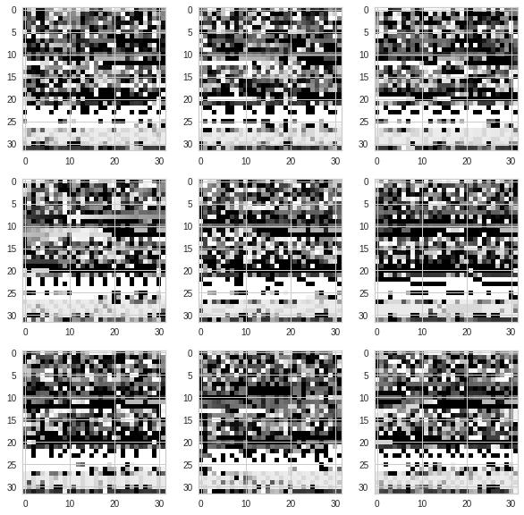
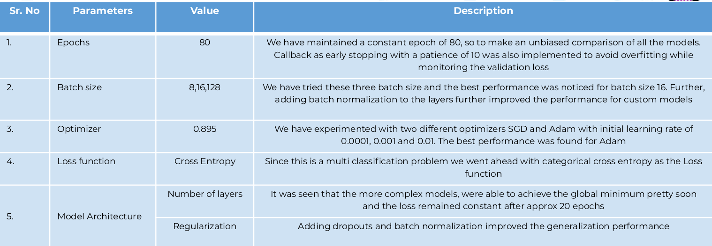
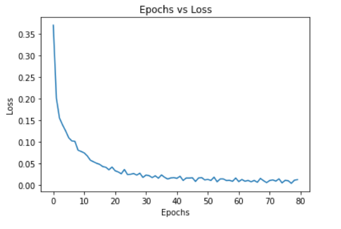
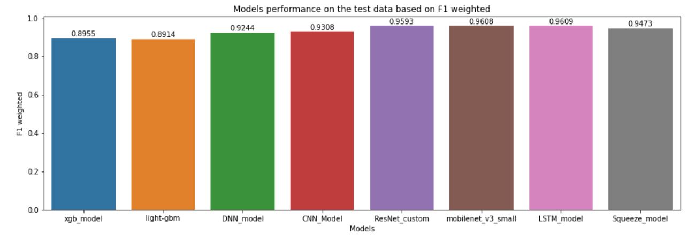
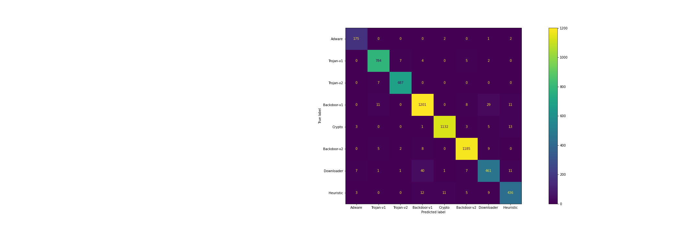

# Portal-Executable-Images-Malware-Analysis-using-Deep-Convolutional-Networks

Portable Executables: The Portable Executable (PE) format is a file format for executables, object code, DLLs, and others used in 32-bit and 64-bit versions of Windows operating systems.

<h2>Problem Introduction </h2>

1. Visualizing PE as images
2. Using Deep Learning to classify PE’s containing Malwares

<h2>Dataset</h2>

Virus MNIST: Portable Executable Files as Images that consists of 10 executable code varieties and
approximately 50,000 virus examples for Malware Detection. The malicious classes include 9 families of
computer viruses and one benign set. Dataset is available on Kaggle.
(https://www.kaggle.com/datamunge/virusmnist)

<h2>Data Preprocessing </h2>

1. Malook for converting the PE files to images using Nearest interpolation
2. Rescaling/Standardization: 32 X 32 gray scale images
3. Dimensionality reduction (PCA T-SNE, and Truncated SVD) Tomek, Nearest Neighbour and cluster centroids for cleaning the data points
4. Features significance using feature importance graphs and density plot visualizations

<h2>Model building</h2>

We implemented couple of traditional machine learning models (such as XgBoost, LightGBM) and deep learning models (such as DNN, CNN, ResNet, MobileNet,LSTM, SqueezeNet), then compared the performance of each model using Pytorch

<h2>Evaluation and Metric</h2>
For evaluating all our models we have used the holdout strategy of creating a dataset using the sklearn test and train split. We have passed the stratify parameter that preserves the same proportions of examples in each class as observed. We calculated both the accuracy and ‘weighted’ F1 score

<h2> Findings on the results </h2>

1. Xgboost Classifier and Lightgbm was treated as baselines with default parameters that achieved a scores of 0.89 approx. where the training was done directly on pixels (1204)
2. Then, Feedforward network DNN was tried with 3 hidden states, dropouts and regularization that further improved the performance
3. After instead of feeding pixels, images were fed to deep convolutional networks followed by fully connected network. Then, different CNN architectures were tried : Resnet: That includes residual blocks, squeezenet that includes fire modules, Mobilenet with inverted residuals were tried
4. Finally, Bi-di LSTM were tried with the intuition that PE images are piece of code that might have interlinking

